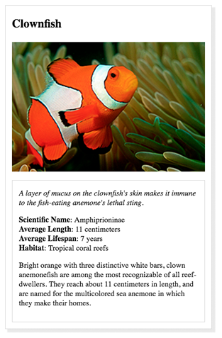
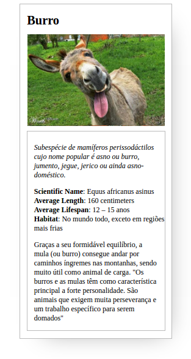

##Projeto 02 | CSS - Figurinhas de Animais

##HTML

```
<!DOCTYPE html>
<html>
<head>
	<meta charset="utf-8">
	<title>Animal Trading Cards</title>
	<link rel="stylesheet" href="styles.css">
</head>
<body>
	<div id="cardboard">
		<!-- your favorite animal's name goes here -->
		<h3>Burro</h3>
		<!-- your favorite animal's image goes here -->
		<div id="image" title="Burro"></div>
		<div id="description">
			<!-- your favorite animal's interesting fact goes here -->
			<p><em>Subespécie de mamíferos perissodáctilos cujo nome popular é asno ou burro, jumento, jegue, jerico ou ainda asno-doméstico.</em></p>
			<ul>
				<!-- your favorite animal's list items go here -->
				<li><span>Scientific Name</span>: Equus africanus asinus</li>
				<li><span>Average Length</span>: 160 centimeters</li>
				<li><span>Average Lifespan</span>: 12 – 15 anos</li>
				<li><span>Habitat</span>: No mundo todo, exceto em regiões mais frias</li>
			</ul>
			<!-- your favorite animal's description goes here -->
			<p>Graças a seu formidável equilíbrio, a mula (ou burro) consegue andar por caminhos íngremes nas montanhas, sendo muito útil como animal de carga. "Os burros e as mulas têm como característica principal a forte personalidade. São animais que exigem muita perseverança e um trabalho específico para serem domados"</p>
		</div>
	</div>
<br>
</body>
</html>
```

---------------------------------------------------------------------------------------------------------------------

###CSS

    h3{
    margin-top: 15px;
    margin-bottom: 15px;
    margin-left: 3%;
    font-size: 1.7em;
    }
    #image{
    width: 300px;
    height: 200px;
    margin-right: auto;
    margin-left: auto;
    background-image: url('Burro-16.jpg');
    background-size: 100% auto;
    }
    #cardboard{
    padding: 5px;
    width: 320px;
    border: 1px solid #BBB;
    position: absolute;
    margin-left: 35px;
    background-color: white;
    box-shadow: 20px 20px 85px -35px #999;
    cursor: pointer;
    }
    #description{
    margin-top: 10px;
    width: 300px;
    border: 1px solid #BBB;
    padding-top: 10px;
    margin-bottom: 10px;
    margin-right: auto;
    margin-left: auto;
    }
    span{
    font-weight: bold;
    }
    img{
    margin-right: auto;
    margin-left: auto;
    width: 300px;
    position: relative;
    left: 3%;
    }
    p {
    padding: 0 15px 0 15px;
    }
    li{
    list-style: none;
    }
    ul{
    text-decoration: none;
    padding-left: 15px;
    }
   
---------------------------------------------------------------------------------------------------

###Expectativa VS Resultado

----------------------------------------------------------------------------------------------------
###Expectativa




###Resultado




